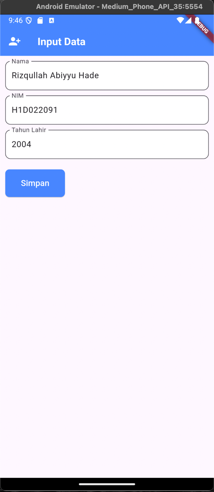
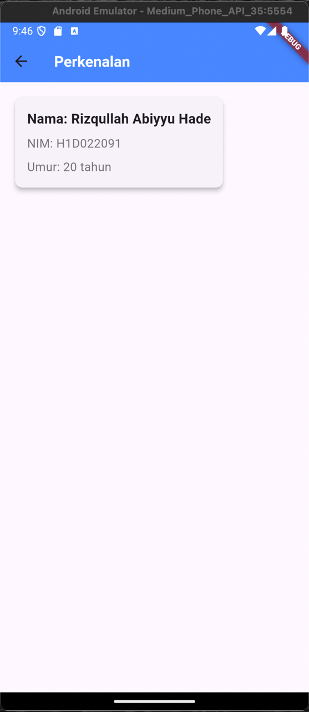

# Tugas Pertemuan 2

## Nama, NIM, Shift
Nama : Rizqullah Abiyyu Hade

NIM : H1D022091

Shift Baru: A

Shift Lama: A

## Proses Passing Data Dari Form Ke Tampilan
- Pada halaman form, data diambil dari TextField menggunakan TextEditingController.
- Ketika tombol 'Simpan' ditekan, data dikirim ke halaman TampilData menggunakan Navigator.of(context).push()
- Lalu pada halaman tampil data, data diterima melalui constructor widget yaitu nama, nim dan tahun.
- Dan menampilkan data ditampilkan dengan format yang telah ditentukan di dalam widget Text.

## Screenshot 
### Halaman Form

### Halaman Tampil

